# ATM
 ATM demo

## 1 Run file ATM.exe in folder App
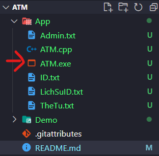
## 2 Choose login user or login admin
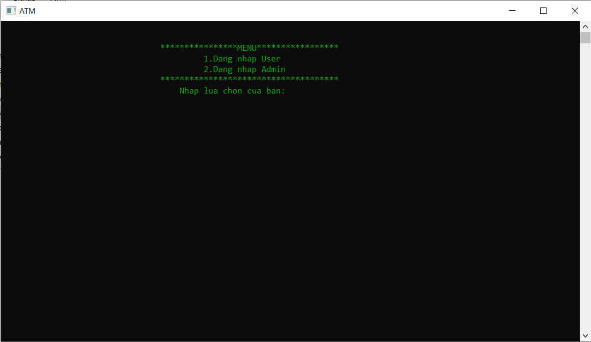
## 3 Login user
Id and password are in file [TheTu.txt](./App/TheTu.txt)
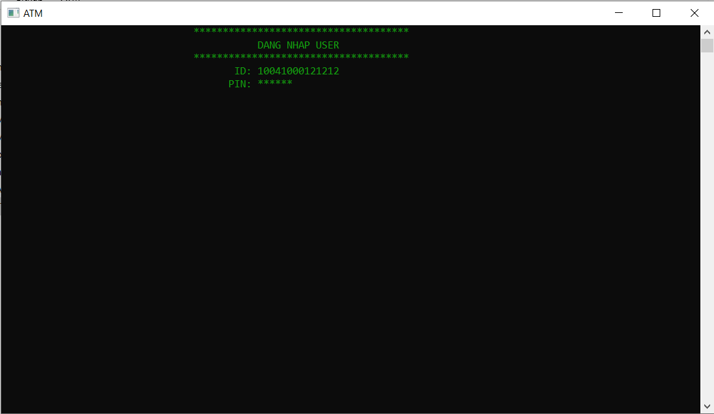
### 3.1 Menu user
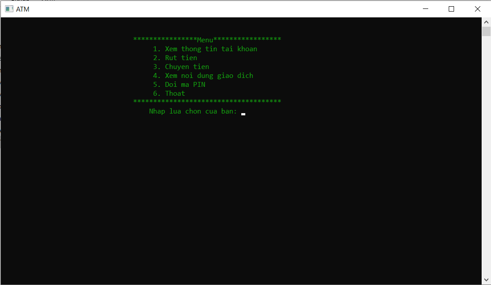
### 3.2 View info user
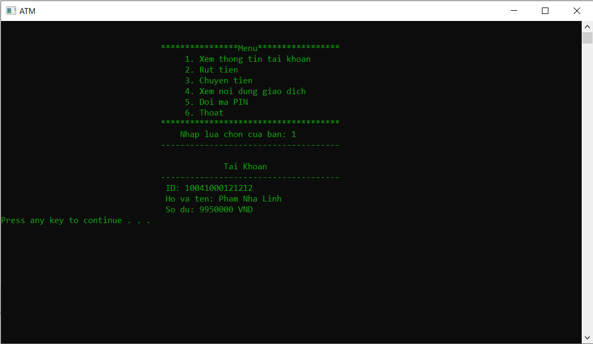
### 3.3 Withdraw money
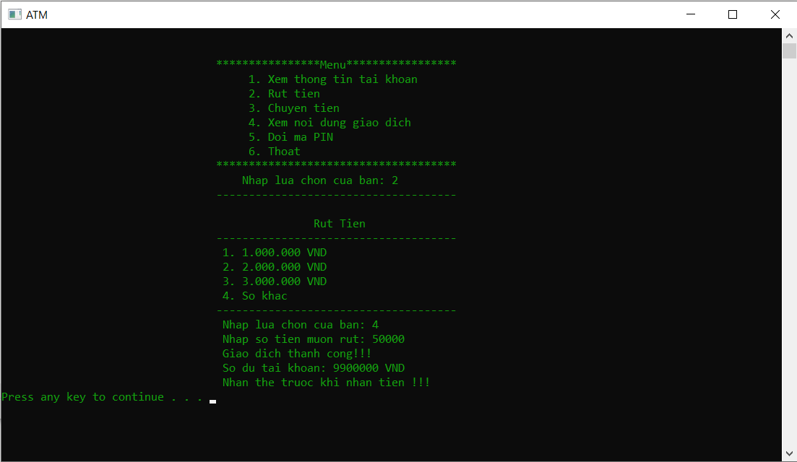
### 3.4 View history
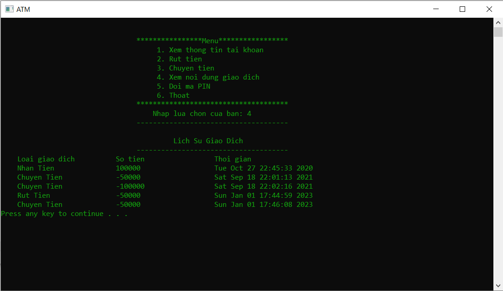
### 3.5 Change PIN

## 4 Login Admin

Id and password are in file [Admin.txt](./App/Admin.txt)
### 4.1 Menu Admin
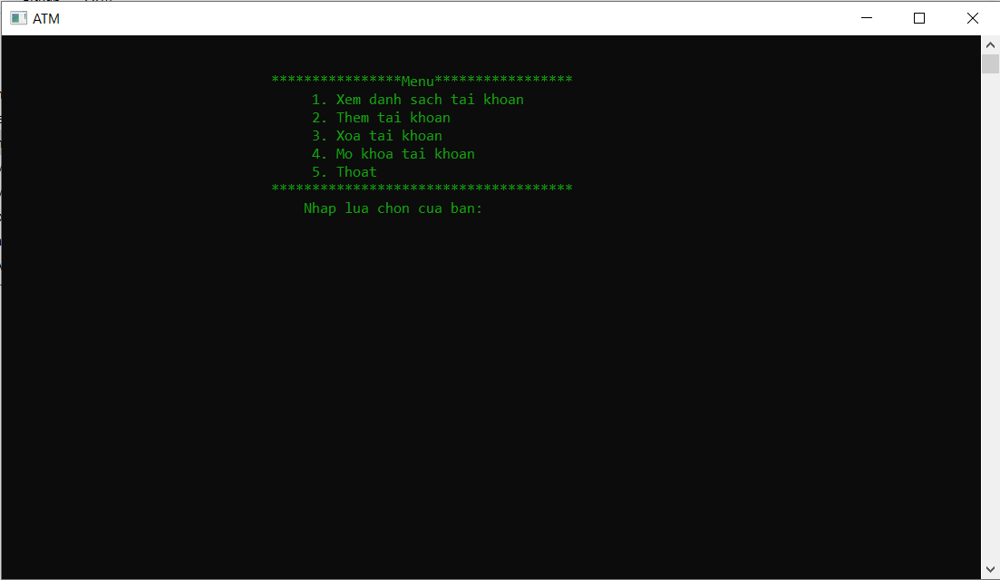
### 4.2 View list account
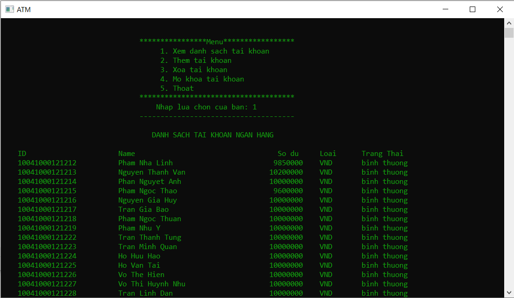
### 4.3 Add account
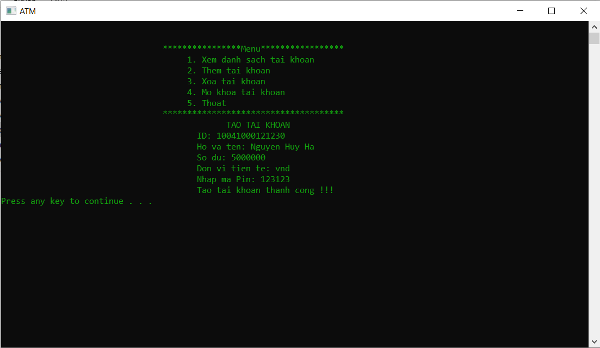
### 4.4 Delete account
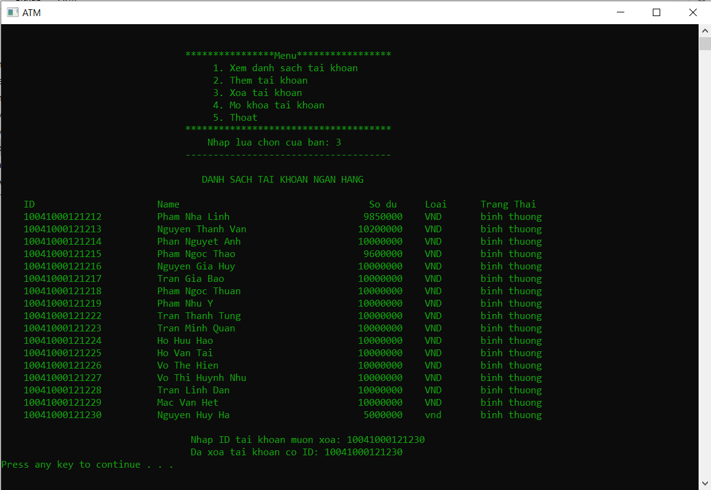
